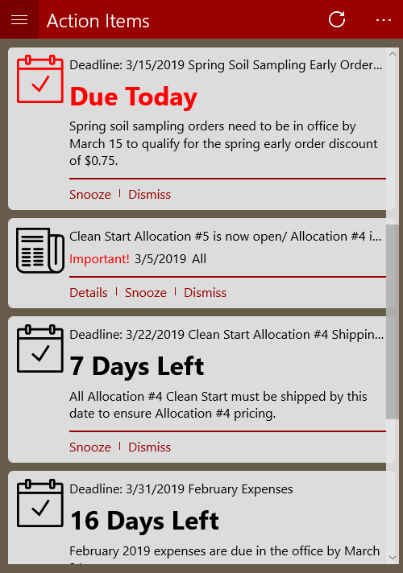
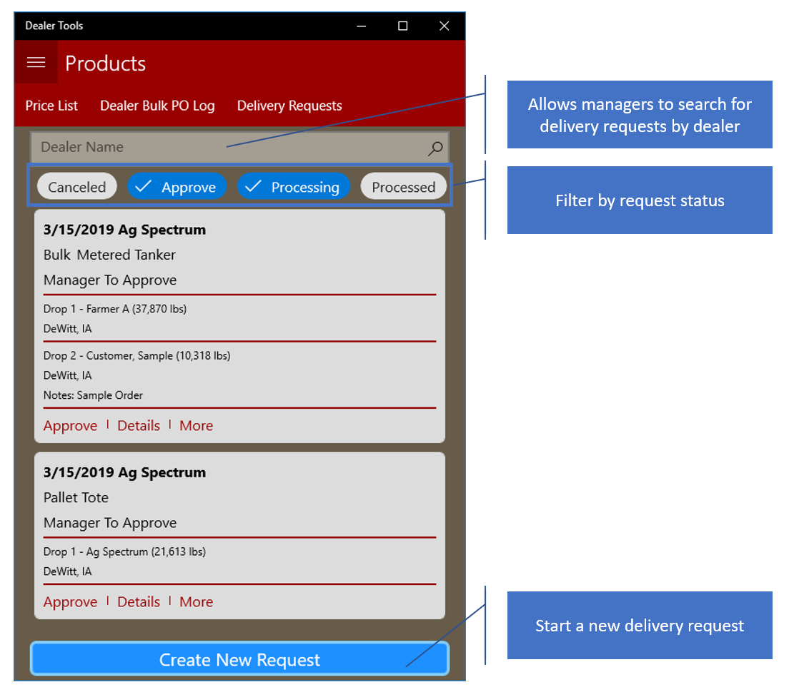
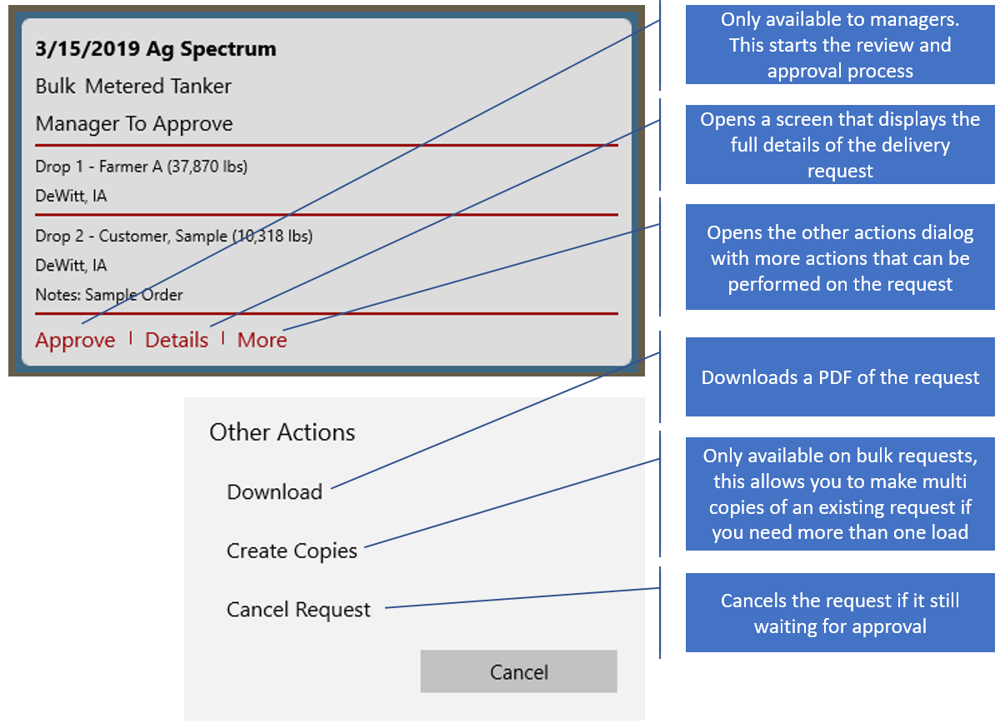
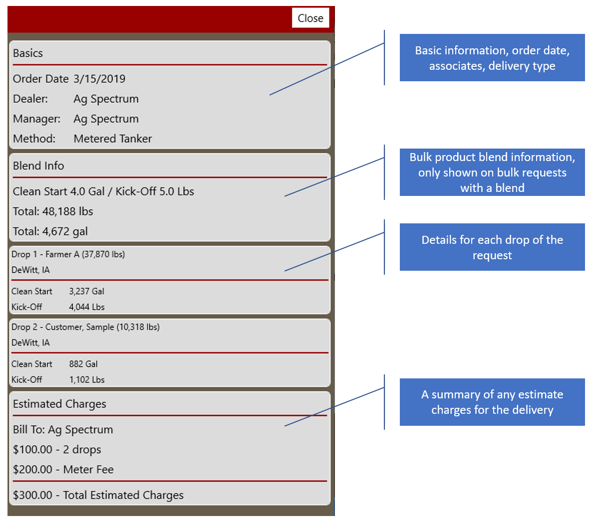

# Delivery Request Management

## Overview

The Delivery Request Management tools allow associates to enter, review, approve and submit delivery requests.

## Contents

* [New Features](#New-Features)
* [Management UI](#Management-UI)
  * [Manage Existing Requests](#Existing-Request-Management)
  * [Request Details](#Request-Details)
* [Create New Delivery Requests](#Submitting-A-New-Request)
	* [Pallet Request](PalletRequest.md)
	* [Bulk Request](BulkRequest.md)

## New Features

* Ordering is completed through a wizard
* Contacts and Address for delivery locations can be pulled from the following existing data
  * Clients and their contacts
  * Dealers and their contacts
  * Company Warehouse Locations
* Bulk orders can be built by entering the desired product mix and weight or volume
  * Additional Drops are entered as the amount of weight or volume desired
* Review and approval process designed to aid in thorough review of requests prior to submission and manager approval
* Area Managers can approve there own requests at the end of the ordering process

## How to find

## Management UI

### Existing Request Management

Available Actions

* Download
* Edit - before manager approval
* Cancel - before manager approval
* Create Copies- only bulk requests

### Request Details

## Submitting A New Request

New requests are submitted using a wizard that will walk you through entering all the needed information for you delivery.  The process differs between bulk and pallet/tote requests.

### [Pallet Request](PalletRequest.md)
### [Bulk Request](BulkRequest.md)