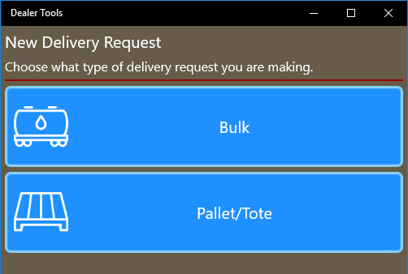
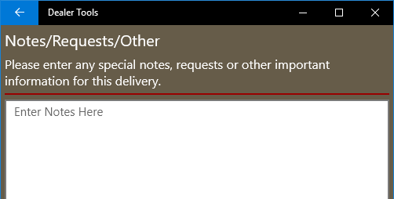

# Pallet Request Process

[Back To Request Management](DeliveryRequestManagementOverview.md)

#### Step 1 - Delivery Type Selection

You are asked to select which type of delivery you are making, either bulk or pallet/tote.  In this example we are going to select pallet/tote.

#### Step 2 - Dealer Selection (Managers Only)

If you are a manager you will be asked if you are submitting this request on behalf of yourself or one of your dealers.  Dealers will not see this step and will move directly to Step 3.

If you select "Choose Dealer" you will be presented with a list of your associates to choose from.  If you select "Myself" you will go to the next step.

#### Step 3 - Delivering to selection

You will be presented with a list of choices of who the product will be delivered too.  Your choices my include:

* The dealer requesting the delivery (most likely yourself)
* To another dealer (if you are a manager)
  * You will be presented with a list of dealers to choose from
* To a client of the requesting dealer
  * You will be presented with a list of clients to choose from
* To a company warehouse (if you are a warehouse manager
  * You will be presented with a list of warehouses to choose from

#### Step 4 - Contact Selection

A list of possible contacts will be shown based on your delivery destination type.  If you don't see the contact or address you need you can manually enter one by selecting "I don't see the location I need".

* Dealer
  * List of contacts linked to the dealership (at time of writing only the office can manage these)
* Client
  * List of contacts linked to the client, you can add, remove or edit these contacts in the Client Hub.
* Warehouse
  * List of contacts maintained by the office for the warehouse

#### Step 5 - Delivery Location Verification

You will be asked to verify the contact and location you selected is correct and to add any additional information required.  Changes may also be made if you found the contact you wanted but the address, contacts or phone numbers are not correct for this delivery.  Any changes you make to their contact information only apply to this request and are not saved back to the original source.

#### Step 6 - Product Selection

This step will have you select the product, packaging type and quantities to have delivered.

* You add a line for each product and packaging you would like.
* After adding the line enter the quality desired.
  * All quantities are entered in number of skids, except for products available by the box.
* The totals column will give you a summary of the actual amount of total product, jugs, boxes, half totes, etc you will be receiving based on the quantity you entered.
  * For example, if you order 1 GroZyme half tote skid, you will received 250 gals, packaged in 2 half totes

#### Step 7 - Notes

Enter any extra notes to help us fulfill your delivery requests

#### Step 8 - Review and Submit

Please review all the details of this request.  You will need to check off each area of review prior to being allowed to submit the request.  If you see red, there is something left for you to review.  Review areas will turn green after you have checked them off.

#### Step 9 - Approval (Managers Only)

If you are a manager and you are submitting a request for yourself an option to immediately approve the request is available.  If you don't want to approve the request until later simply choose that option. 

