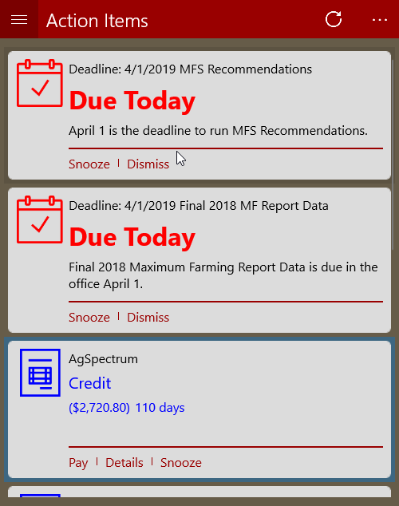
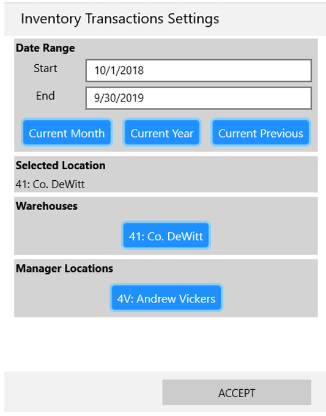
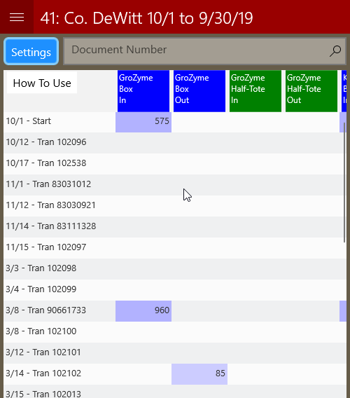

# Inventory Transactions

## Overview

The inventory transactions tool allows managers to view sales and warehouse transactions

## How to find

## Inventory Transactions Settings

When opening the inventory transactions tool the first thing you will see is the settings.  Here you may select the date range you want as well as the location you want to view.

To change the date range either enter dates or choose from one of the pre defined ranges.

To change the location tap on the location you want to view.

When you are done making adjustments, tap Accept to load the transactions

## Main View

All transactions for the location and date range you selected will be shown.  You can filter the transactions in several ways when you tap on a column or row header.

* Item or Item and Packaging
* Specific Document
* Specific Document Type

You can also open a source document by tapping on the row header.

You can use the document number filter to search for a document if you already know it's number.

